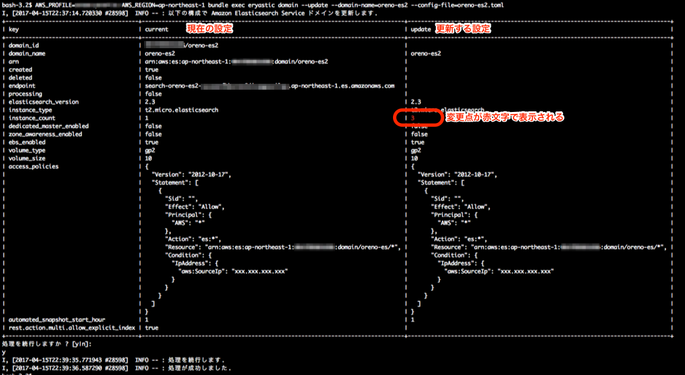

# Eryastic

Amazon Elasticsearch Service ドメインを管理するツール.

## About

- Amazon Elasticsearch Service ドメインの作成、削除等を行う
- 設定ファイル toml フォーマット

## Installation

```sh
git clone ..
cd eryastic
bundle install --path vendor/bundle
```

## Usage

### help

```sh
$ bundle exec eryastic --help
Commands:
  eryastic domain          # Amazon Elasticsearch Service ドメインを操作する.
  eryastic help [COMMAND]  # Describe available commands or one specific command
  eryastic version         # version 情報を出力.
```

### 設定ファイル

toml フォーマットで以下のように記載する.

```toml
[main]
domain_name = "oreno-es2"
elasticsearch_version = "2.3"
access_policies = '''
{
  "Version": "2012-10-17",
  "Statement": [
    {
      "Sid": "",
      "Effect": "Allow",
      "Principal": {
        "AWS": "*"
      },
      "Action": "es:*",
      "Resource": "arn:aws:es:ap-northeast-1:xxxxxxxxxxx:domain/oreno-es/*",
      "Condition": {
        "IpAddress": {
          "aws:SourceIp": "xxx.xxx.xxx.xxx"
        }
      }
    }
  ]
}
'''

[elasticsearch_cluster_config]
instance_type = "t2.micro.elasticsearch"
instance_count = 1
dedicated_master_enabled = false
zone_awareness_enabled = false

[ebs_options]
ebs_enabled = true
volume_type = "gp2"
volume_size = 10

[snapshot_options]
automated_snapshot_start_hour = 1
```

### Amazon Elasticsearch Service ドメインの操作

####  help

```sh
$ bundle exec eryastic --help domain
Usage:
  eryastic domain

Options:
  -c, [--create], [--no-create]    # Amazon Elasticsearch Service ドメインを作成する.
  -d, [--delete], [--no-delete]    # Amazon Elasticsearch Service ドメインを削除する.
  -e, [--export], [--no-export]    # Amazon Elasticsearch Service ドメインの設定を export する.
  -l, [--list], [--no-list]        # Amazon Elasticsearch Service ドメインの一覧を取得する.
  -u, [--update], [--no-update]    # Amazon Elasticsearch Service ドメイン構成を更新する.
  -n, [--domain-name=DOMAIN_NAME]  # Amazon Elasticsearch Service ドメイン名を指定する.
  -f, [--config-file=CONFIG_FILE]  # Amazon Elasticsearch Service 設定ファイルを指定する.

Amazon Elasticsearch Service ドメインを操作する.
```

#### Amazon Elasticsearch Service ドメインの一覧を取得する

- run

```sh
$ AWS_PROFILE=xxxxx AWS_REGION=ap-northeast-1 bundle exec eryastic domain --list
```

- output

```sh
I, [2017-04-15T22:23:40.059602 #25839]  INFO -- : Amazon Elasticsearch Service ドメインの一覧を取得します.
+-------------+-----------------------------------------------------------------------------+-----------------------+---------+---------+------------+
| domain_name | endpoint                                                                    | elasticsearch_version | created | deleted | processing |
+-------------+-----------------------------------------------------------------------------+-----------------------+---------+---------+------------+
| oreno-es1   | search-oreno-es1-xxxxxxxxxxxxxxxxxxxxxxxxxx.ap-northeast-1.es.amazonaws.com | 2.3                   | true    | false   | false      |
+-------------+-----------------------------------------------------------------------------+-----------------------+---------+---------+------------+
```

#### Amazon Elasticsearch Service ドメインを作成する

- run

```sh
$ AWS_PROFILE=xxxxx AWS_REGION=ap-northeast-1 bundle exec eryastic domain --create --config-file=setting.toml
```

- output

```sh
I, [2017-04-15T22:25:44.451627 #26254]  INFO -- : 以下の構成で Elasticsearch ドメインを作成します.
+-------------------------------+-------------------------------------------------------------------------------+
| key                           | value                                                                         |
+-------------------------------+-------------------------------------------------------------------------------+
| domain_name                   | oreno-es2                                                                     |
| elasticsearch_version         | 2.3                                                                           |
| access_policies               | {                                                                             |
|                               |   "Version": "2012-10-17",                                                    |
|                               |   "Statement": [                                                              |
...
|                               |   ]                                                                           |
|                               | }                                                                             |
| instance_type                 | t2.micro.elasticsearch                                                        |
| instance_count                | 1                                                                             |
| dedicated_master_enabled      | false                                                                         |
| zone_awareness_enabled        | false                                                                         |
| ebs_enabled                   | true                                                                          |
| volume_type                   | gp2                                                                           |
| volume_size                   | 10                                                                            |
| automated_snapshot_start_hour | 1                                                                             |
+-------------------------------+-------------------------------------------------------------------------------+
処理を続行しますか ? [y|n]:
y
I, [2017-04-15T22:27:30.283862 #26254]  INFO -- : 処理を続行します.
I, [2017-04-15T22:27:31.292834 #26254]  INFO -- : 処理が成功しました.
```

#### Amazon Elasticsearch Service ドメインを削除する

- run

```sh
$ AWS_PROFILE=xxxxx AWS_REGION=ap-northeast-1 bundle exec eryastic domain --delete --domain-name=oreno-es1
```

- output

```sh
I, [2017-04-15T22:29:44.633351 #27057]  INFO -- : 以下の Amazon Elasticsearch Service ドメインを削除します.
+-------------------------------+-------------------------------------------------------------------------------+
| key                           | value                                                                         |
+-------------------------------+-------------------------------------------------------------------------------+
| domain_name                   | oreno-es1                                                                     |
| elasticsearch_version         | 2.3                                                                           |
| access_policies               | {                                                                             |
|                               |   "Version": "2012-10-17",                                                    |
|                               |   "Statement": [                                                              |
...
|                               |   ]                                                                           |
|                               | }                                                                             |
| instance_type                 | t2.micro.elasticsearch                                                        |
| instance_count                | 1                                                                             |
| dedicated_master_enabled      | false                                                                         |
| zone_awareness_enabled        | false                                                                         |
| ebs_enabled                   | true                                                                          |
| volume_type                   | gp2                                                                           |
| volume_size                   | 10                                                                            |
| automated_snapshot_start_hour | 1                                                                             |
+-------------------------------+-------------------------------------------------------------------------------+
処理を続行しますか ? [y|n]:
y
I, [2017-04-15T22:27:30.283862 #26254]  INFO -- : 処理を続行します.
I, [2017-04-15T22:27:31.292834 #26254]  INFO -- : 処理が成功しました.
```

#### Amazon Elasticsearch Service ドメインの設定を export する

- run

```sh
$ AWS_PROFILE=xxxxx AWS_REGION=ap-northeast-1 bundle exec eryastic --export --domain-name=oreno-es2 --config-file=oreno-es2.toml
```

- output

```sh
I, [2017-04-15T22:32:25.935996 #27636]  INFO -- : Amazon Elasticsearch Service ドメイン oreno-es2 設定を export します.
[main]
domain_id = "xxxxxxxxxxxxxxxx/oreno-es2"
arn = "arn:aws:es:ap-northeast-1:xxxxxxxxxxxxxxxx:domain/oreno-es2"
domain_name = "oreno-es2"
endpoint = ""
elasticsearch_version = "2.3"
access_policies = '''
{
  "Version": "2012-10-17",
  "Statement": [
...
  ]
}
'''

[elasticsearch_cluster_config]
instance_type = "t2.micro.elasticsearch"
instance_count = 1
dedicated_master_enabled = false
zone_awareness_enabled = false


[ebs_options]
ebs_enabled = true
volume_type = "gp2"
volume_size = 10


[snapshot_options]
automated_snapshot_start_hour = 1
```

`--config-file` で指定したファイルに toml フォーマットにて設定が出力されている.

#### Amazon Elasticsearch Service ドメイン構成を更新する

- run

```sh
$ AWS_PROFILE=xxxxx AWS_REGION=ap-northeast-1 bundle exec eryastic domain --update --domain-name=oreno-es2 --config-file=oreno-es2.toml
```

- output



## tips

### 構成の確認

eryastic で作成、削除、更新したリソースについて、awspec で確認することが出来る.

```sh

```

以下の実行例のように `spec:xxxx` は awspec での確認となり、`check:xxxx` がスクリプトでの確認となる.

```sh
```

尚、将来的には `check:xxxx` は廃止して、`spec:xxxx` に統一する予定.

## TODO

- advanced_options を toml で指定出来るようにする
- snapshot メニューの追加
- 構成確認処理の追加
- テストの追加

## Development

After checking out the repo, run `bin/setup` to install dependencies. You can also run `bin/console` for an interactive prompt that will allow you to experiment. Run `bundle exec eryastic` to use the gem in this directory, ignoring other installed copies of this gem.

To install this gem onto your local machine, run `bundle exec rake install`. To release a new version, update the version number in `version.rb`, and then run `bundle exec rake release`, which will create a git tag for the version, push git commits and tags, and push the `.gem` file to [rubygems.org](https://rubygems.org).

## Contributing

Bug reports and pull requests are welcome on GitHub at https://github.com/[USERNAME]/eryastic.
